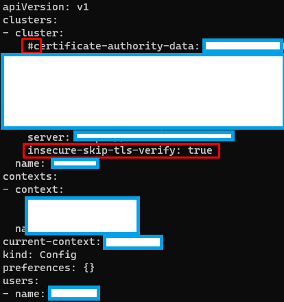

# ORI-ARM-Cluster

## Abrimos puertos en la web de Oracle Cloud Free Tier

## Asignamos las características de nuestra máquina

## Abrimos puertos dentro del sistema operativo

Primero actualizamos el sistema

```bash
sudo apt update && sudo apt upgrade -y
```

Abrimos los puertos de nuestro sistema; dependiendo del sistema operativo que estés corriendo tendrás que usar un comando u otro, aunque yo recomiendo abrirlos todos (usar todos los comandos).

```bash
sudo apt -y install firewalld
firewall-cmd --permanent --zone=public --add-port=6443/tcp
firewall-cmd --permanent --zone=public --add-port=443/tcp
firewall-cmd --permanent --zone=public --add-port=80/tcp
sudo firewall-cmd --reload
```

```bash
sudo ufw allow 6443
sudo ufw allow 443
sudo ufw allow 80
```

```bash
iptables -A INPUT -p tcp --dport 6443 -j ACCEPT
iptables -A INPUT -p tcp --dport 443 -j ACCEPT
iptables -A INPUT -p tcp --dport 80 -j ACCEPT
```

## Instalamos Docker

```bash
sudo apt-get update
sudo apt-get install ca-certificates curl gnupg
```

```bash
sudo install -m 0755 -d /etc/apt/keyrings
curl -fsSL https://download.docker.com/linux/ubuntu/gpg | sudo gpg --dearmor -o /etc/apt/keyrings/docker.gpg
sudo chmod a+r /etc/apt/keyrings/docker.gpg
```

```bash
echo \
  "deb [arch="$(dpkg --print-architecture)" signed-by=/etc/apt/keyrings/docker.gpg] https://download.docker.com/linux/ubuntu \
  "$(. /etc/os-release && echo "$VERSION_CODENAME")" stable" | \
  sudo tee /etc/apt/sources.list.d/docker.list > /dev/null
```

```bash
sudo apt-get update
sudo apt-get install docker-ce docker-ce-cli containerd.io docker-buildx-plugin docker-compose-plugin
```

También podemos agregar docker en un grupo de confianza, para que no tengamos que usar _sudo_ cada vez que queramos usarlo.

```
sudo usermod -aG docker ${USER}
newgrp docker
```

Por último, actualizamos el sistema de nuevo

```
sudo apt update -y && sudo apt upgrade -y && sudo systemctl reboot -y
```

## Instalamos k3s

```bash
curl -sfL https://get.k3s.io | sh -s - --docker
```

Comprobamos que _kubectl_ funciona correctamente.

```bash
sudo kubectl get nodes -o wide
```

Damos permisos al config, y lo copiamos al .kube

```bash
sudo chmod 644 /etc/rancher/k3s/k3s.yaml

mkdir ~/.kube
sudo cp /etc/rancher/k3s/k3s.yaml ~/.kube/config
```

En la configuración, debemos añadir la línea `insecure-skip-tls-verify: true`

Y también comentar el certificado, como vemos en la imagen.


